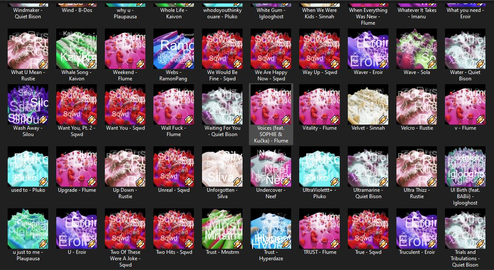

# Index
1. [Introduction](#introduction)

1.1 [But... why?](#Butwhy)

2. [The project](#the_project)

2.1 [Drawing.py](#drawing)

2.2 [GenerativeArtworks.py](#generativeartworks)

3. [Results](#results)

---

# Introduction

**Generative Artwork** is a Python program that creates unique artworks based on the artists' names from a folder full of songs. The program extracts the names of the artists from the metadata of the audio files and uses them to generate a "trippy" art design along with a random draw. The resulting image is then superimposed over a background image to create a visually stunning artwork.

## But... why?

You must be saying "what? Who in the world downloads their music? Doesn't everyone use streaming services?"" The first answer is "me", and the second answer is "no".

To be clear, a lot of the music I like is not simply on Spotify, as I enjoy listening to independent artists, and they upload their music to services like Soundcloud, or even allow free downloads of their songs.

Now, the problem lies in the fact that I don't necessarily "like" the song or album covers. In fact the vast majority of the time I simply don't like them and they generate a feeling of "visual inconsistency".

  

Also, I don't really like to make this kind of decisions, it's just a matter of aesthetics, I can automate the process. So.. yeah, that's the reason.

---

# The project

Basically the project consists of two parts. One handled exclusively by the Python program, and one "handled" by me, a human being (I think).

## [Drawing.py](Drawing.py)

This code generates an art image using random lines and the artist's name written in random positions and font sizes. The image is saved to a file specified by the 'path' argument. The `PIL` library is used to handle image manipulation.

The main function `generate_art()` creates a blank RGBA image of size 2000x2000 pixels. It generates random points inside the image with some constraints and draws white lines between them, with a thickness between 5 and 10 pixels. The start and end colors of the lines are white by default but can be changed. After drawing the lines, the artist's name is written on the image in random positions, font sizes, and transparencies.

The final image is resized to a target size of 1000x1000 pixels and saved to the file specified by 'path'.

For example:

  

## [GenerativeArtworks.py](GenerativeArtworks.py)

The code starts by importing necessary libraries such as `os`, `random`, `mutagen`, `csv`, `Drawing.py` and `PIL`. Then, the code sets a directory path to a folder containing music files.

Next, the code creates an empty list to store the names of the artists. The program iterates over each file in the directory and checks if it is an audio file. If it is, the program reads the artist name using mutagen library and adds it to the artist list if it is not already there.

Then, the program creates a CSV file named `artists.csv` and writes the artist names to the file using the `csv` library.

After that, the program generates artwork for each artist by calling the `generate_art()` function from the Drawing library. It also generates a random number between 1 and 25 using the `random` library and adds it to a list of used numbers to avoid repetition.

The program then loads two images: the background image (which is selected from the Screenshots directory using the random number chosen above) and the foreground image (which is the corresponding drawing generated with the artist's name, and named as such), resizes the foreground image to match the size of the background image and composites the foreground image onto the background image. The background image is darkened using `ImageEnhance` library, then the composite image is saved to a file in a folder called "Outputs".

# Results

Finally, after a few touches using [Pixlr Batch Editor](https://pixlr.com/es/batch/), we have some beautiful covers.

  

That can be placed on each song (also batch editing), using the open source tool [Mp3tag](https://www.mp3tag.de/en/), which I love so much.

  

